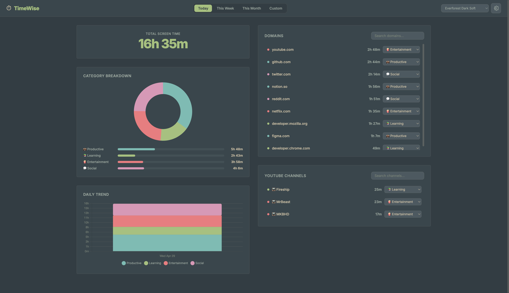
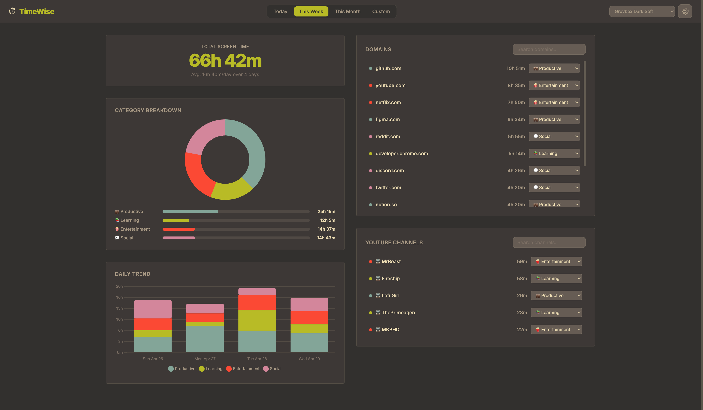
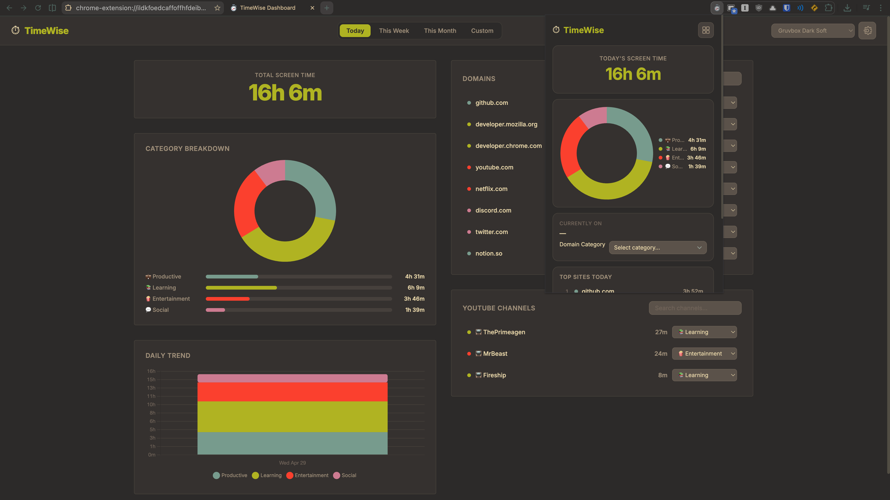

# ⏱️ TimeWise

A local browser extension that tracks your screen time and categorizes your activity in the browser.

  

 

  
  

<em>Demo screenshots showcasing the TimeWise dashboard views.</em>

## ✨ Features

* **Smart Tracking:** Intelligently pauses tracking when you switch to internal pages (like `chrome://` or the New Tab page) or when your computer goes idle.
* **Advanced YouTube Tracking:** 
  * Tracks the *channel* you are watching, allowing you to categorize different creators (e.g., categorizing educational channels as "Study" and entertainment as "Wasted").
  * **Shorts:** Automatically groups all YouTube Shorts into a single pseudo-channel so you can easily isolate and track endless scrolling time.
* **Privacy Friendly:** All analytics, browsing history, and tracking data are stored locally on your machine using Chrome's native storage. No tracking APIs etc.
* **Beautiful Dashboard:** A locally rendered dashboard featuring donut charts, daily trend graphs, and detailed domain-by-domain breakdowns.
* **Dynamic Themes:** Built-in support for multiple color schemes (including Everforest, Nord, Dracula, and more).

## 🚀 Installation

Since TimeWise is currently not on the Chrome Web Store, you can easily install it locally:

1. Clone or download this repository.
2. Open Chrome and navigate to `chrome://extensions`.
3. Enable **Developer mode** in the top right corner.
4. Click **Load unpacked** and select the `TimeWise` folder.
5. Pin the ⏱️ extension icon to your toolbar and click it to open your popup or dashboard!

## 🛠️ Built With

* **Vanilla JavaScript** - Lightweight and blazing fast.
* **HTML5 / CSS3** - Classic, responsive flexbox layout.
* **[Chart.js](https://www.chartjs.org/)** - For the beautiful, interactive dashboard analytics.

## 🔮 Future Roadmap
- [ ] Weekly/Monthly comparative analytics like in Apple's Screen Time app.
- [ ] Export data to CSV functionality.
- [ ] Companion native macOS application for system-wide app tracking (integrating with Chrome data via Native Messaging).

## 🤝 Contributing
Please open issues or submit pull requests if you have ideas for new features or changes/improvements.

---
*Built to help you take back control of your time.*
